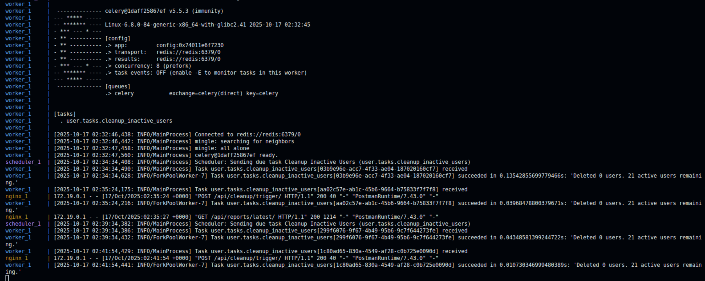

## Getting Started

For detailed instructions on setting up and running the Django backend, see the Backend README:

[Backend Setup & Instructions](backend/README.md)

This includes:

- Django project setup
- Virtual environment / pip installation
- Periodic tasks and Celery setup
- Running the Django development server 

---
## Screen Shot
### cleanup executed task list

### Manual Trigger response which queue task for cleanup

### console log of task being executed

---