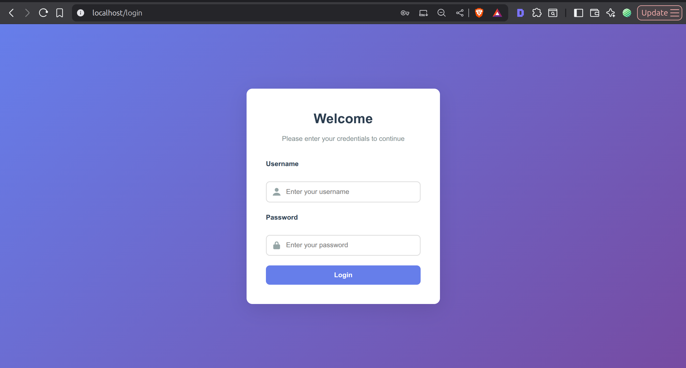
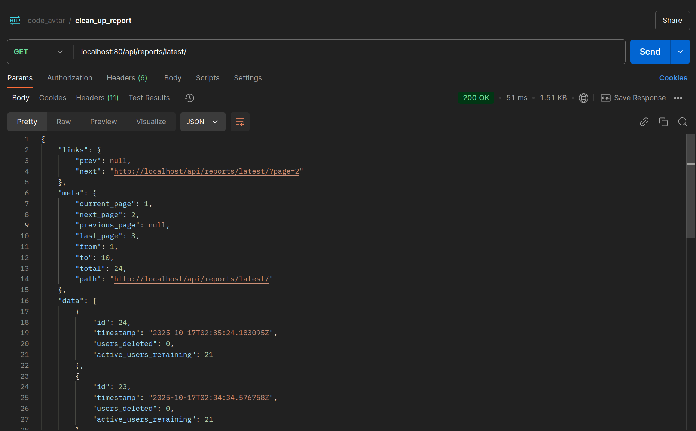
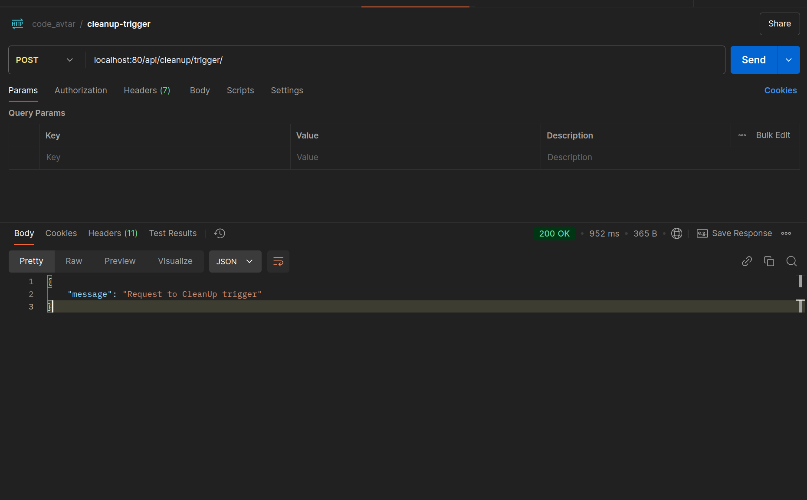

## Getting Started

For detailed instructions on setting up and running the Django backend, see the Backend README:

[Backend Setup & Instructions](backend/README.md)

This includes:

- Django project setup
- Virtual environment / pip installation
- Periodic tasks and Celery setup
- Running the Django development server 


---

## 📝 TODO

- frontend implementation
    - alert message issue
    - ui button for manual trigger is in UI but function remaining
- authentication [need to check refresh token is working or not]
- notification [email notification, email submission remaining]
- testing [view wise testing remaining]
- documentation
    - frontend README.md file remaining
    - api endpoint detail documentation
    - clean up main README.md file 

---

## Screen Shot of UI
#### Project Front-end Overview

- User Interface (UI) and CSS: The UI components and styling have been designed and generated with the assistance of an LLM (Large Language Model).

- Project Structure and Other Components: The overall project structure, logic, functionalities have been developed manually.


### login page


### Clean Up Report Page


### Clean Up list of Data with server side pagination


## Screen Shot of API
### cleanup executed task list


### Manual Trigger response which queue task for cleanup


### console log of task being executed


---

### Run Project using Docker Compose

```bash
# create .docker.env with the help of .example.env


# Note: run this command after build
# create superuser for login credentials 
docker-compose run backend uv run python manage.py createsuperuser

# populate random 50 row data to database
docker-compose run backend uv run python populate_users.py
```

Run all the container
```bash
docker-compose up --build
```
- ```up```: Starts all services defined in docker-compose.yml.
- ```--build```: Forces rebuilding images before starting containers.
- Add ```-d``` if you want to run containers in detached/background mode

Once started, your app will be available at:
http://localhost:80

Run all the container
```bash
docker-compose down
```
Stops all running containers.

Removes containers, networks, and default volumes created by docker-compose up.

If you want to also remove images and named volumes, you can use:
```bash
docker-compose down --rmi all -v
```

