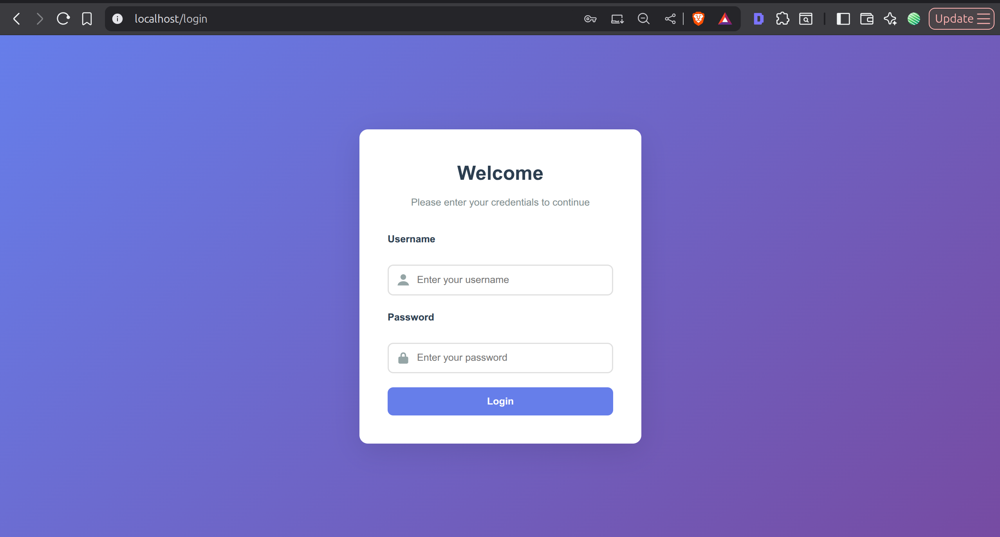
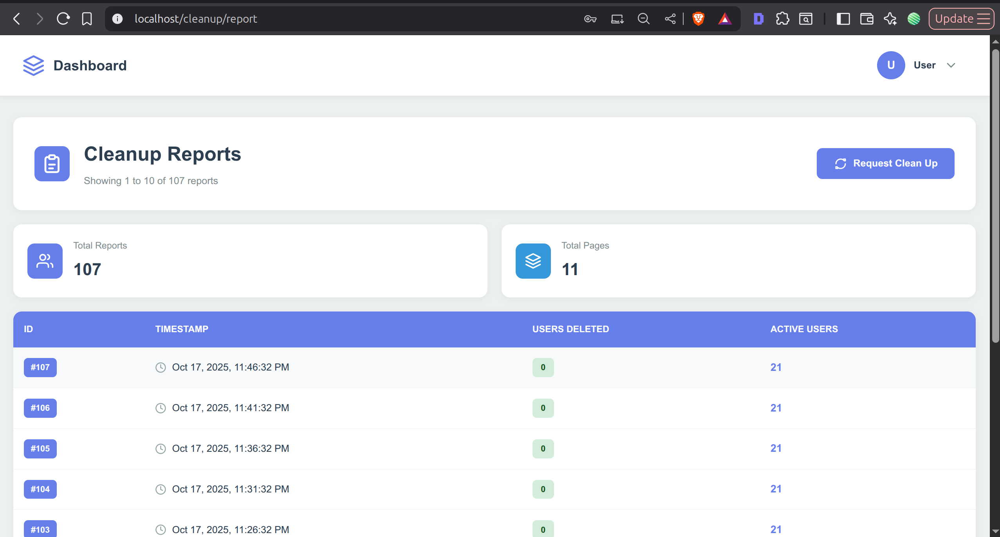
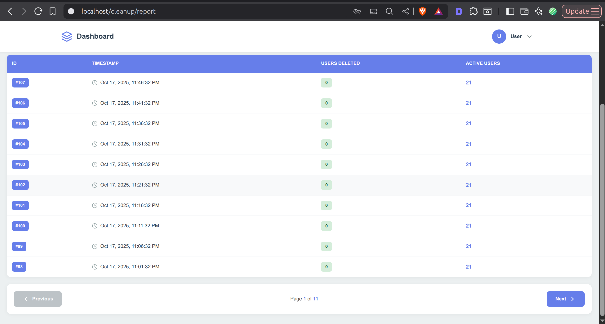
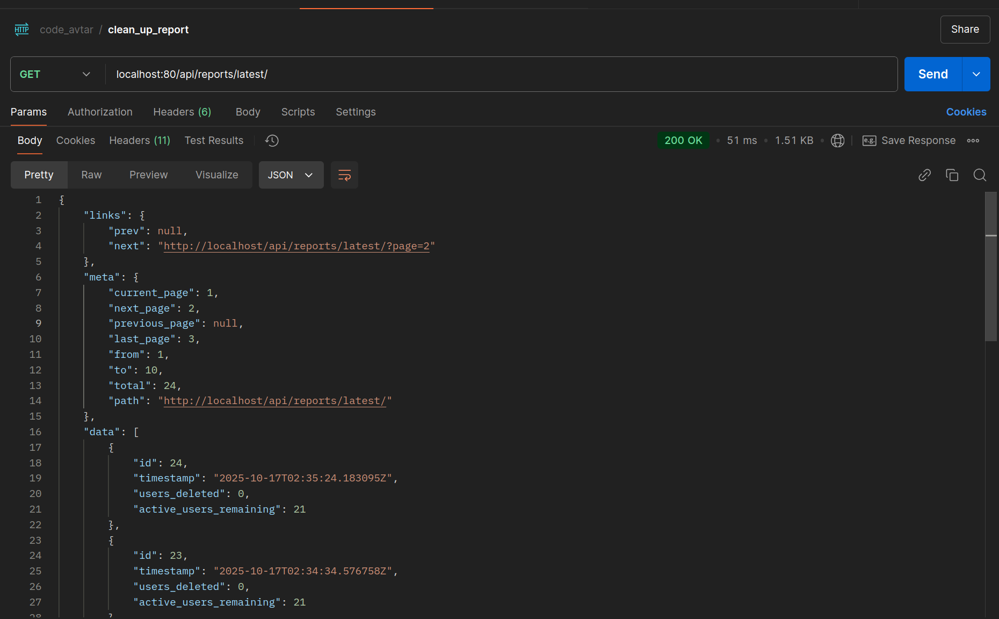
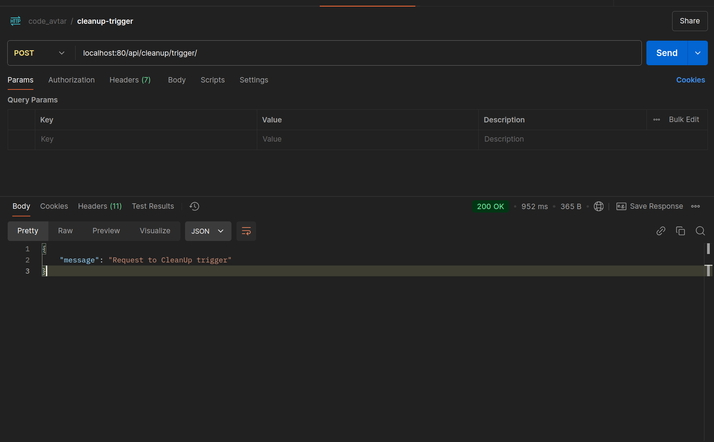
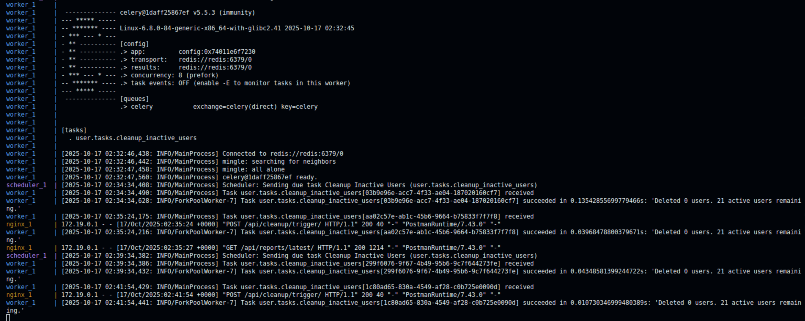
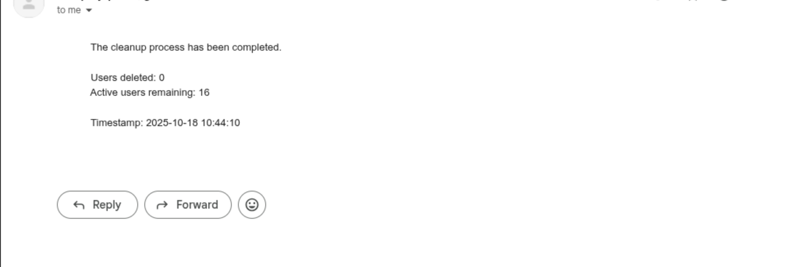

## Getting Started

For detailed instructions on setting up and running the Django backend, see the Backend README:

[Backend Setup & Instructions](backend/README.md)

## Table of Contents

- [Features](#features)
- [Todo](#todo)
- [Screen Shot Frontend](#screen-shot-of-ui)
- [Screen Shot Backend](#screen-shot-of-api)
- [Installation & Run](#installation-docker-compose)


### Features:
- dockerize project
- authentication with refresh token are blacklist after rotation or logout
- email reporting when clean task is executed
- email error reporting to admin if any thing break
- celery with dead letter queue implement to track failed task  


---

## TODO

- testing [view wise testing remaining]
- documentation
    - api endpoint detail documentation
- notification trigger for submission remaining 

---

## Screen Shot of UI
#### Project Front-end Overview

- User Interface (UI) and CSS: The UI components and styling have been designed and generated with the assistance of an LLM (Large Language Model).

- Project Structure and Other Components: The overall project structure, logic, functionalities have been developed manually.


### login page


### Clean Up Report Page


### Clean Up list of Data with server side pagination


## Screen Shot of API
### cleanup executed task list


### Manual Trigger response which queue task for cleanup


### console log of task being executed


### email after report being generated


---

## Installation Docker Compose
setup env for backend docker file name should be .docker.env
```env
# ./backend/.docker.env
SECRET_KEY=<your-secret>
DEBUG = False

# Celery broker URL
CELERY_BROKER_URL=redis://redis:6379/0

# Celery result backend
CELERY_RESULT_BACKEND=redis://redis:6379/0

# Cache URL
REDIS_URL= redis://redis:6379/1

EMAIL_BACKEND=django.core.mail.backends.smtp.EmailBackend
EMAIL_HOST=smtp.gmail.com
EMAIL_PORT=587
EMAIL_HOST_USER=<your-email>
EMAIL_HOST_PASSWORD=<your-app-password>
EMAIL_USE_TLS=True
DEFAULT_FROM_EMAIL=<your-default-email>

# Admin recipients (Optional)
ADMIN_EMAIL_1=<your-admin1-email>
ADMIN_EMAIL_2=<your-admin2-email>
```

Run all the container
```bash
# after creating .docker.env with the help of .example.env
docker-compose up --build
```
- ```up```: Starts all services defined in docker-compose.yml.
- ```--build```: Forces rebuilding images before starting containers.
- Add ```-d``` if you want to run containers in detached/background mode

Once started, your app will be available at:
http://localhost:80

```bash
# Note: run this command after build
# create superuser for login credentials 
docker-compose run backend uv run python manage.py createsuperuser

# populate random 50 row data to database
docker-compose run backend uv run python populate_users.py
```

Run all the container
```bash
docker-compose down
```
Stops all running containers.

Removes containers, networks, and default volumes created by docker-compose up.

If you want to also remove images and named volumes, you can use:
```bash
docker-compose down --rmi all -v
```

